# OCR & Document Research Tool

A desktop and mobile software project for OCR, document processing, source referencing and research-oriented document workflows.

The application is designed to support the complete workflow from capturing or importing documents to OCR processing, text analysis, document navigation and reusable source references.

This repository is a **public showcase** of the project.  
The application itself is under active development and its source code is maintained in a private repository.

## Project Overview

The project started as an OCR application for analysing PDF and image documents and has gradually developed into a broader document-processing system.

Its goal is to combine several steps that are often handled by separate applications:

- importing PDF and image documents
- capturing documents with a mobile device
- improving and correcting document images
- performing OCR with different recognition engines
- comparing and evaluating OCR results
- analysing recognised text
- navigating between text and the original document
- creating persistent source references
- connecting document references with Microsoft Word
- preserving document identity across different document versions

The application is particularly designed with research-oriented document workflows in mind.

## Preview

Screenshots and additional visual documentation will be added to this showcase repository.

## Core Features

### OCR and text recognition

The application supports multiple OCR workflows and recognition engines.

Current functionality includes:

- OCR of PDF and image files
- support for scanned and digitally generated PDFs
- integration of multiple OCR engines
- comparison of OCR results
- confidence-based evaluation of recognised text
- identification of low-confidence words
- word frequency analysis
- contextual display of recognised words
- export of OCR results

OCR technologies used in the project include:

- PaddleOCR
- Scribe.js
- Tesseract.js

### Example of text recognition
  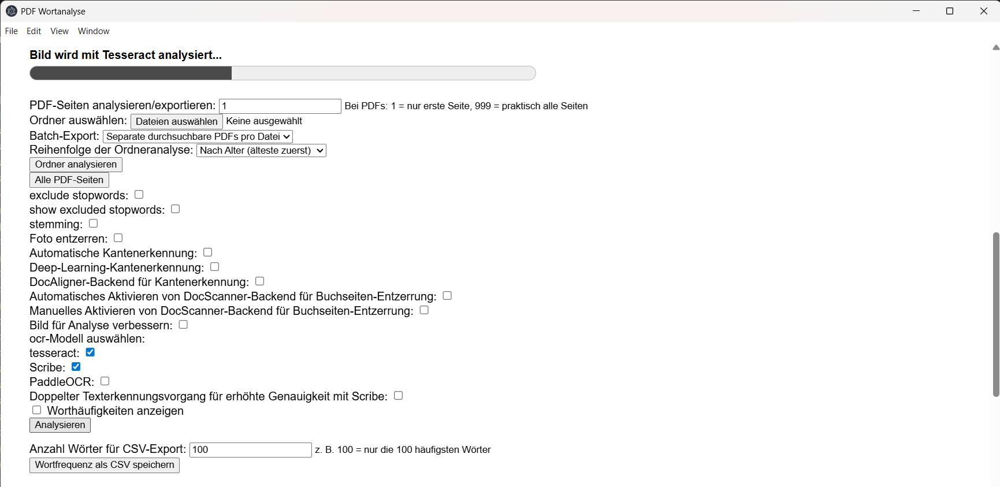

### Document image processing

Before OCR, document images can be prepared and corrected.

Features include:

- contrast enhancement
- sharpening
- adaptive thresholding
- automatic inversion
- deskewing
- document corner detection
- perspective correction
- page dewarping
- manual correction of detected document boundaries

Several local processing components are used so that document images can be processed without depending entirely on external cloud services.

### Example of manual deskewing
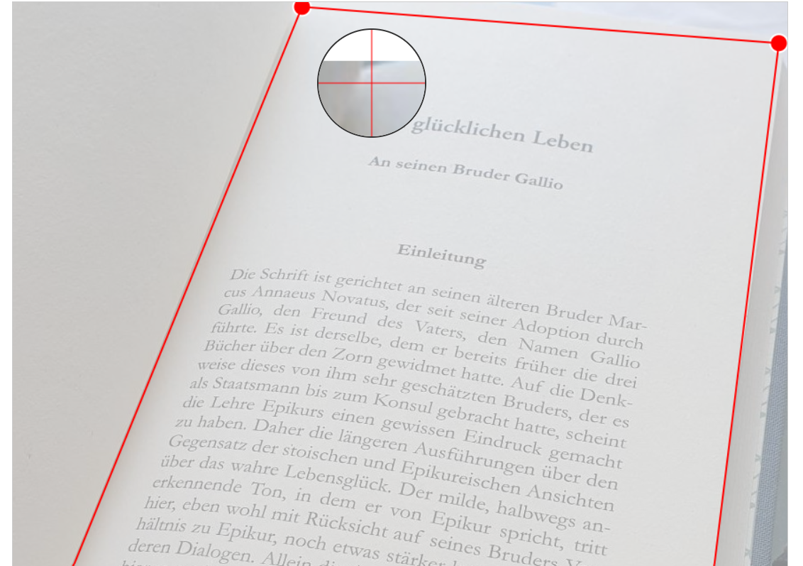

### PDF processing

The application supports document-oriented PDF workflows, including:

- PDF import
- scanned document processing
- page-based OCR analysis
- searchable PDF generation
- merging OCR results with document pages
- navigation between recognised text and the original page

## Text Analysis

Recognised text can be analysed directly inside the application.

The interface provides functionality such as:

- word frequency lists
- text contexts
- word highlighting
- confidence information
- navigation between occurrences
- identification of potentially incorrect OCR results

The aim is not only to extract text, but also to make OCR results easier to inspect and use in research workflows.

### Recognized words overview placed over the initial recognized image
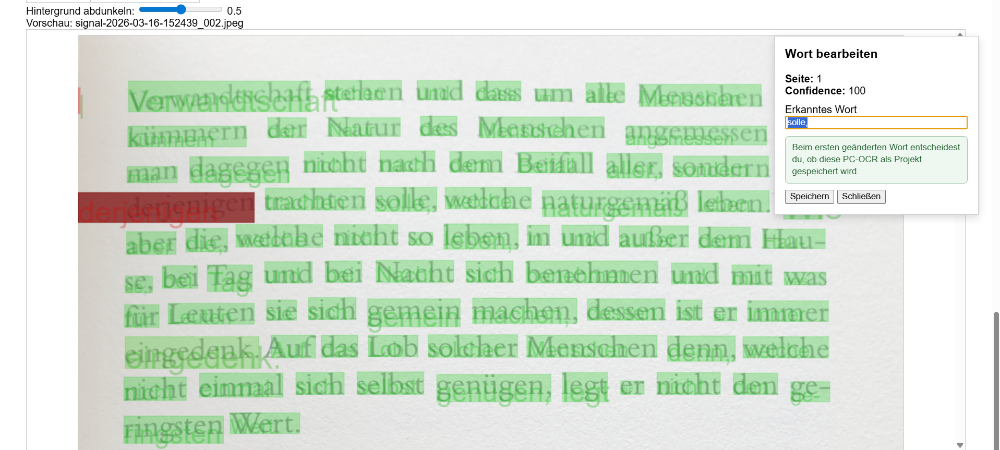

### Clickable List of low confidence words 
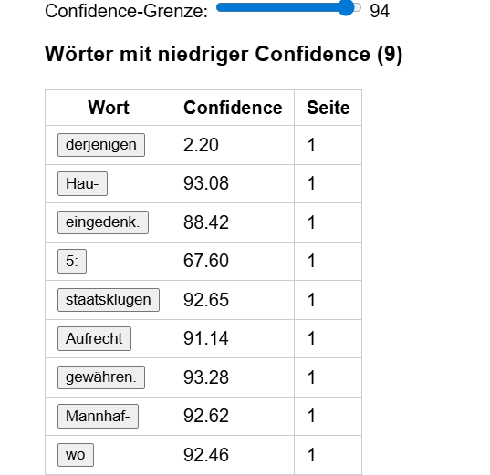

### List of the word frequency within the analyzed text
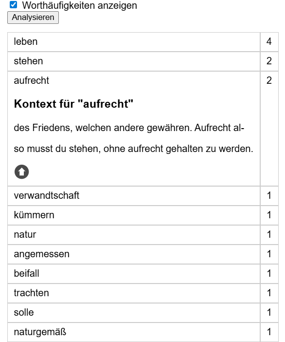

## Citation and Source Reference Workflow

A central part of the project is a citation system for digital source material.

Users can create persistent references to specific locations within a document and later reopen the corresponding source location directly in the OCR application.

The workflow is designed to connect recognised text, the original document and the research context while preserving a reliable link back to the source.

These references can later be reopened directly inside the OCR application.

### Microsoft Word Integration

The project includes a Microsoft Word Add-in that connects written documents with the OCR application.

This allows a source reference created in the OCR tool to be linked with a citation in Word.

The integration is implemented using Microsoft Office.js and communication between the Word Add-in and the desktop application.

### Word add-in
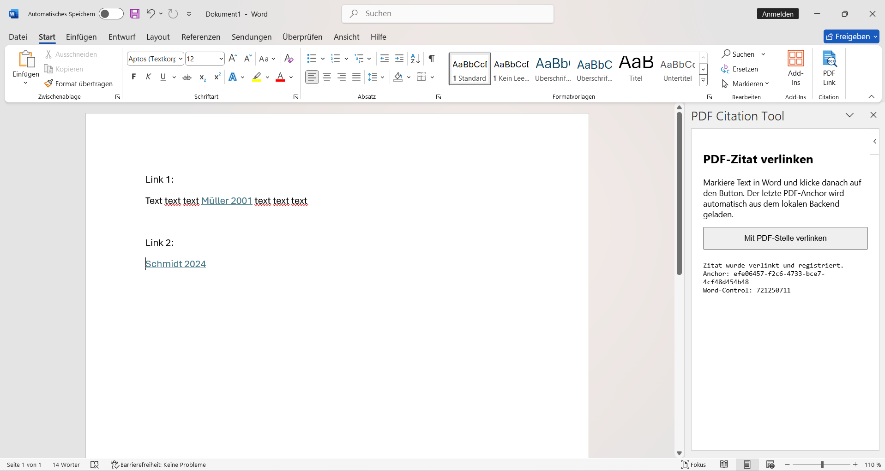

### Links opened in the OCR & Document Research Tool
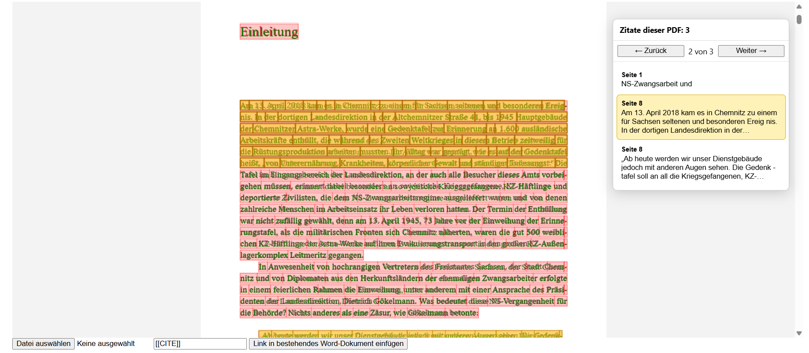

## Document Identity and Versioning

Historical and research documents may change over time.

Pages can be inserted, removed, reordered or replaced while references to the document already exist.

The application therefore includes a document identity and versioning concept designed to preserve reliable references across changing document versions.

This requires the application to distinguish between documents, document versions and individual pages while maintaining the relationship between existing source references and the underlying material.

The long-term goal is to keep source references usable even when a document is replaced by a modified version.

The detailed matching and identification mechanisms are part of the private implementation.

## `.ocrproject` Exchange Format

The desktop and mobile components exchange document projects through a dedicated project format.

The format preserves the structure of a capture project together with the information required for continued processing on the desktop application.

This allows document capture and OCR processing to remain separate while maintaining project structure and source provenance.

The detailed format specification and internal data model are intentionally not part of this public showcase.

The mobile application intentionally focuses on document capture rather than performing OCR directly on the phone.

Captured projects can then be transferred to the desktop application for further processing.

### Android app overview
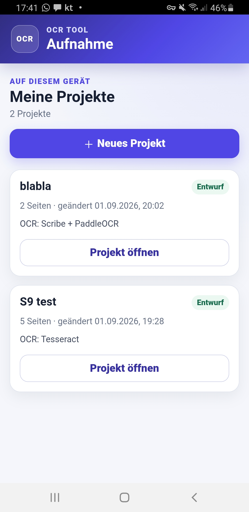

### Android app project overview

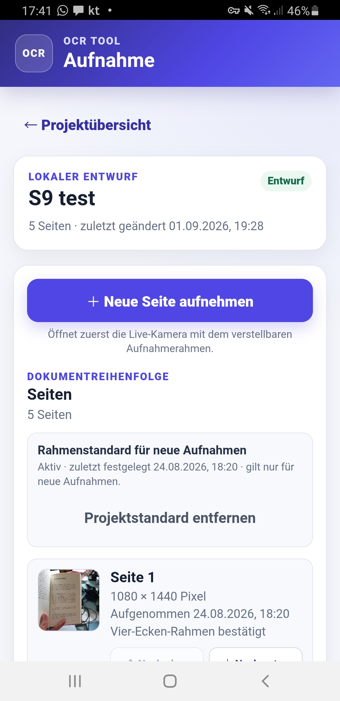

### List of images in a project

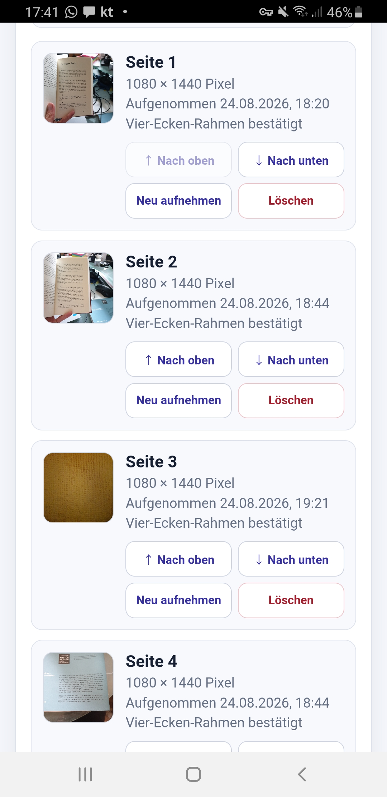

### Taking a photo 

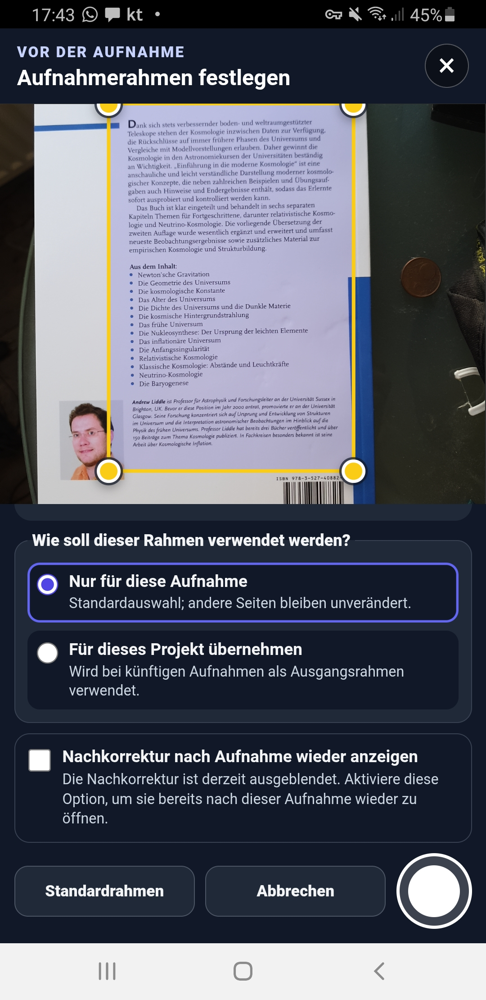

## Architecture

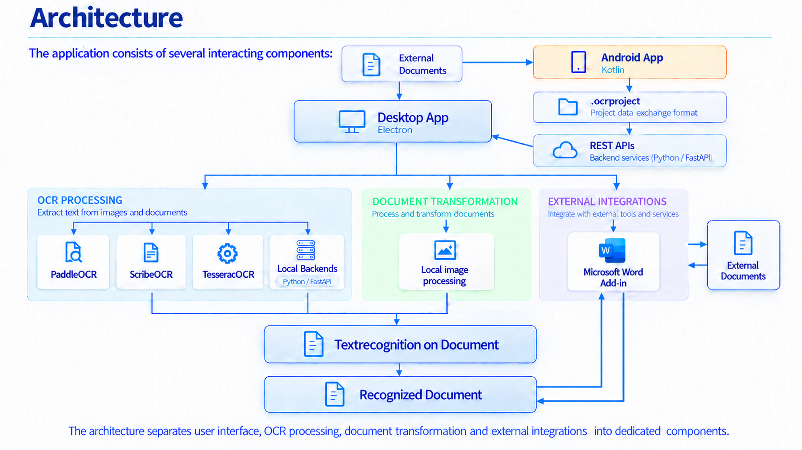

## Technologies

### Desktop application

- JavaScript
- HTML5
- CSS3
- Electron
- Node.js

### Backend and document processing

- Python
- FastAPI
- REST APIs
- OpenCV
- PaddleOCR
- image-processing services

### OCR

- PaddleOCR
- Scribe.js
- Tesseract.js

### Mobile application

- Kotlin
- Android
- Android Studio

### Document integration

- PDF processing
- Microsoft Office.js
- Word Add-in
- JSON
- local application APIs
- custom deep links

### Development and architecture

- Git / GitHub
- REST-based communication
- asynchronous processing
- document identity management
- data validation
- versioned project formats

## Technical Challenges

The project involves several problems that go beyond basic OCR.

Examples include:

- coordinating multiple OCR engines
- evaluating different OCR results
- processing large documents
- maintaining page and document identity
- keeping citations valid when documents change
- connecting desktop and mobile applications
- exchanging structured document projects
- integrating a desktop application with Microsoft Word
- coordinating multiple local processing services
- preserving document provenance throughout the workflow

These challenges have required not only implementation work, but also the design of data structures, interfaces and application workflows.

## What I Have Learned

Working on this project has given me practical experience with:

- designing a larger software application
- breaking complex requirements into separate components
- frontend and backend communication
- REST interfaces
- asynchronous workflows
- desktop application development with Electron
- Python backend services
- OCR and document-processing technologies
- Android development with Kotlin
- document metadata and identity
- versioning concepts
- integration between independent applications
- debugging multi-component systems
- designing software around real user workflows

An important part of the project has been translating problems from practical document work into technical requirements and software functionality.

## Project Context

The project is independently developed and is currently under active development.

It combines my interests and experience in:

- software development
- document processing
- archives and historical sources
- research workflows
- digitisation
- OCR
- digital source referencing

The project is independently developed and remains under active development.

